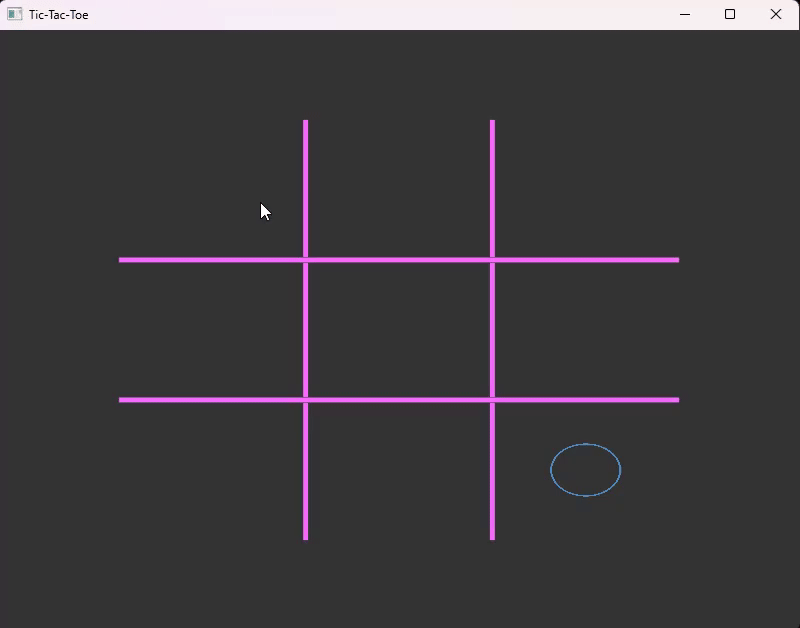

# Tic-Tac-Toe

A simple graphics Tic-Tac-Toe game created in C++.



---

# Dependencies/Pre-requisites

### OpenGL

OpenGL library is used as the rendering framework

 
### GLFW

Custom fork of glfw is [submoduled](Tic-Tac-Toe/dependencies/GLFW) with the project (only for the premake file).
It is used for windowing and input events handling.


### Python (3.13+)

Used to run the main build script to invoke premake

### [Magic-Enum](https://github.com/Neargye/magic_enum)

A header file for enum reflection for debugging purpose. 


### Windows Specifics

- Visual Studio version 2026 


###  Linux Specifics  

- #### bear
	`bear` is used to generate linting hints for nvim users. You can skip installing it by removing the relavant `bear` command in the [scripts/build.py](scripts/build.py) file

To install everything in single command in linux mint run the following in terminal (untested)
`sudo apt-get install mesa-utils mesa-common-dev bear`
or equivalent package manager commands

---

# BUILDING

```
git clone git@github.com:WoodenNebula/Tic-Tac-Toe.git --recursive Tic-Tac-Toe
cd Tic-Tac-Toe
python ./scripts/build.py
```


### Windows

After running the above commands, you need to open the visual studio solution generated in project directory and hitting play button should work out of the box

### Linux

The above command should be enough to launch the project in linux.<br>
If you get error saying linking fail, make sure to complete (Pre-requisite) first
